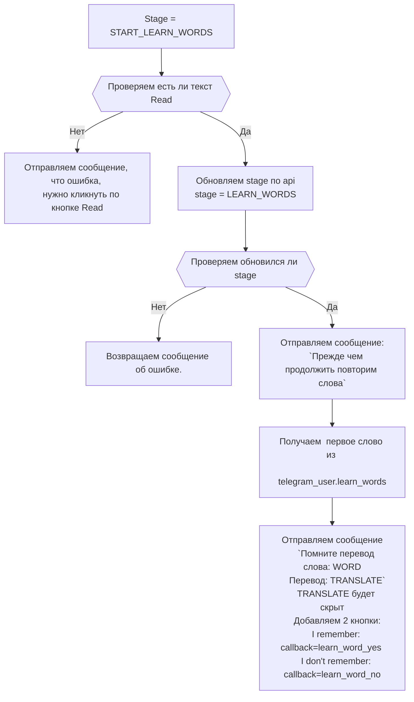
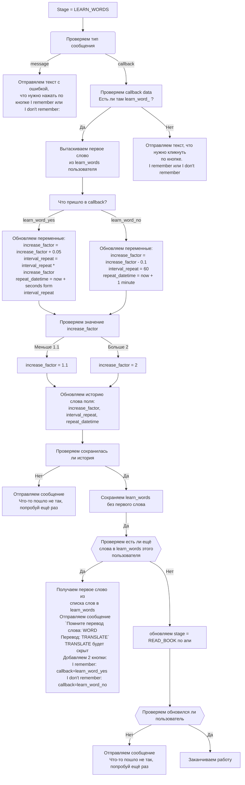

```mermaid
graph TD;
    start[Stage = START_LEARN_WORDS] --> check_text{{
    Проверяем есть ли текст Read
    }}
    check_text --> |Нет| return_error_message[
    Отправляем сообщение, что ошибка, 
    нужно кликнуть по кнопке Read
    ]
    check_text -->|Да| update_user_stage[
    Обновляем stage по api
    stage = LEARN_WORDS
    ]
    update_user_stage --> check_update_user_stage{{
    Проверяем обновился ли stage
    }}
    check_update_user_stage --> |Нет| not_update_user_stage[
    Возвращаем сообщение об ошибке.
    ]
    check_update_user_stage -->|Да| send_first_message[
    Отправляем сообщение:
    `Прежде чем продолжить повторим слова`]
    send_first_message -->  get_first_word[Получаем  первое слово из 
    telegram_user.learn_words]
    get_first_word --> send_message[
    Отправляем сообщение
    `Помните перевод слова: WORD
    Перевод: TRANSLATE`
    TRANSLATE будет скрыт
    Добавляем 2 кнопки:
    I remember: callback=learn_word_yes 
    I don't remember: callback=learn_word_no
    ]
```

```mermaid
graph TD;
    start[Stage = LEARN_WORDS] --> check_type_message(Проверяем тип сообщения)
    check_type_message --> |message| check_text_message[
    Отправялем текст с ошибкой, 
    что нужно нажать по кнопке I remember или 
    I don't remember:
    ]
    check_type_message --> |callback| check_callback_data[Проверяем callback data
    Есть ли там learn_word_ ?]
    check_callback_data --> |Да| get_first_word[
    Вытаскиваем первое слово
    из learn_words пользователя]
    get_first_word --> check_callback_answer[Что пришло в callback?]
    check_callback_answer --> |learn_word_yes| remember_word[Обновляем переменные:
    increase_factor = increase_factor + 0.05
    interval_repeat = interval_repeat * increase_factor
    repeat_datetime = now +  seconds form interval_repeat]
    check_callback_answer --> |learn_word_no| dont_remember_word[Обновляем переменные:
    increase_factor = increase_factor - 0.1
    interval_repeat = 60
    repeat_datetime = now + 1 minute]
    remember_word --> check_increase_factor[Проверяем значение increase_factor]
    dont_remember_word --> check_increase_factor
    check_increase_factor --> |Больше 2| more_2_increase_factor[increase_factor = 2]
    check_increase_factor --> |Меньше 1.1| less_1.1_increase_factor[increase_factor = 1.1]
    less_1.1_increase_factor --> save_words_history
    more_2_increase_factor --> save_words_history[
    Обновляем историю слова поля:
    increase_factor, interval_repeat, repeat_datetime
    ]
    save_words_history --> check_save_words_history[Проверяем сохранилась ли история]
    check_save_words_history --> |Нет| bad_save_words_history[
    Отправляем сообщение
    Что-то пошло не так, попробуй ещё раз
    ]
    check_callback_data --> |Нет| wrong_callback_data[Отправляем текст, что нужно кликнуть
    по кнопке. 
    I remember или I don't remember]
    check_save_words_history --> |Да| update_context_learn_words[
    Сохраняем learn_words без первого слова
    ]
    update_context_learn_words --> |Да| check_learn_words{{
    Проверяем есть ли ещё
    слова в learn_words этого
    пользователя
    }}
    check_learn_words --> |Да| send_message[
    Получаем первое слово из
    списка слов в learn_words
    Отправляем сообщение
    `Помните перевод слова: WORD
    Перевод: TRANSLATE`
    TRANSLATE будет скрыт
    Добавляем 2 кнопки:
    I remember: callback=learn_word_yes 
    I don't remember: callback=learn_word_no
    ]
    check_learn_words --> |Нет| update_stage_user[
    обновляем stage = READ_BOOK по апи
    ]
    update_stage_user --> check_update_stage_user{{
    Проверяем обновился ли пользователь
    }}
    check_update_stage_user --> |Нет| send_error_after_not_update_user[
    Отправляем сообщение
    Что-то пошло не так, попробуй ещё раз
    ]
    check_update_stage_user --> |Да| send_message_end_words[
    Заканчиваем работу]
    
    classDef new fill:#69f,stroke:#333,stroke-width:2px;
```
