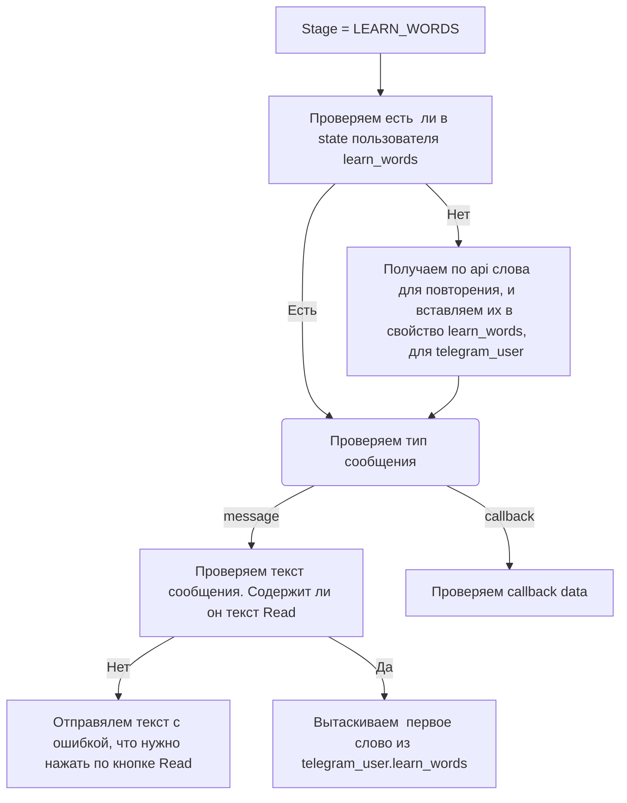

```mermaid
graph TD;
    start[Stage = LEARN_WORDS] --> check_state_words[Проверяем есть  ли в state пользователя learn_words];
    check_state_words-->|Нет| dont_have_words[
    Получаем по api слова для повторения, и 
    вставляем их в свойство learn_words, 
    для telegram_user
    ]
    check_state_words --> |Есть| check_type_message(Проверяем тип сообщения)
    dont_have_words --> check_type_message
    check_type_message --> |message| check_test_message[Проверяем текст сообщения. Содержит ли он текст Read]
    check_type_message --> |callback| check_callback_data[Проверяем callback data]
    check_test_message --> |Нет| wrong_text_message[Отправялем текст с ошибкой, что нужно нажать по кнопке Read]
    check_test_message --> |Да| get_first_word[Вытаскиваем  первое слово из telegram_user.learn_words]
```