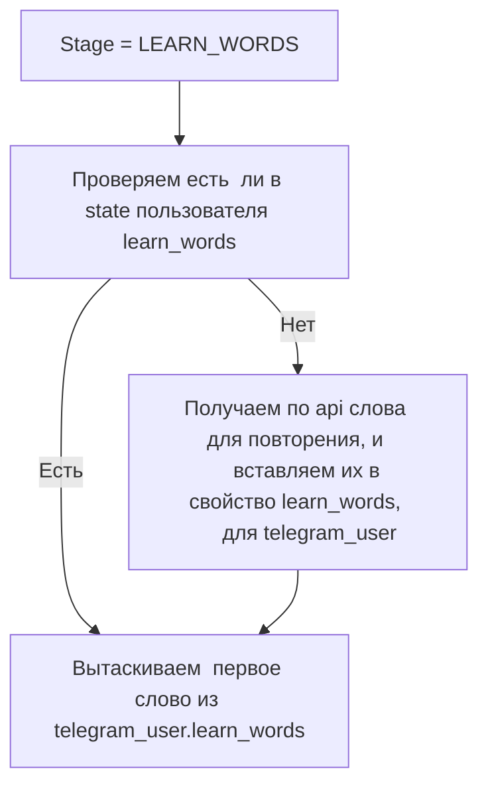

```mermaid
graph TD;
    start[Stage = LEARN_WORDS] --> check_state_words[Проверяем есть  ли в state пользователя learn_words];
    check_state_words-->|Нет| dont_have_words[
    Получаем по api слова для повторения, и 
    вставляем их в свойство learn_words, 
    для telegram_user
    ]
    check_state_words -->|Есть| get_first_word[Вытаскиваем  первое слово из telegram_user.learn_words]
    dont_have_words --> get_first_word
    
```