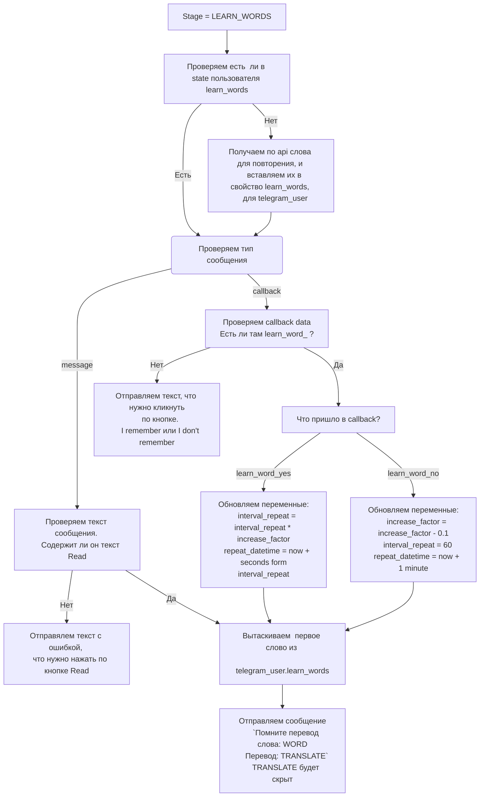

```mermaid
graph TD;
    start[Stage = LEARN_WORDS] --> check_state_words[Проверяем есть  ли в state пользователя learn_words];
    check_state_words-->|Нет| dont_have_words[
    Получаем по api слова для повторения, и 
    вставляем их в свойство learn_words, 
    для telegram_user
    ]
    check_state_words --> |Есть| check_type_message(Проверяем тип сообщения)
    dont_have_words --> check_type_message
    check_type_message --> |message| check_test_message[Проверяем текст сообщения. 
    Содержит ли он текст Read]
    check_type_message --> |callback| check_callback_data[Проверяем callback data
    Есть ли там learn_word_ ?]
    check_test_message --> |Нет| wrong_text_message[Отправялем текст с ошибкой, 
    что нужно нажать по кнопке Read]
    check_test_message --> |Да| get_first_word[Вытаскиваем  первое слово из 
    telegram_user.learn_words]
    check_callback_data --> |Да| check_callback_answer[Что пришло в callback?]
    check_callback_answer --> |learn_word_yes| remember_word[Обновляем переменные:
    interval_repeat = interval_repeat * increase_factor
    repeat_datetime = now +  seconds form interval_repeat]
    check_callback_answer --> |learn_word_no| dont_remember_word[Обновляем переменные:
    increase_factor = increase_factor - 0.1
    interval_repeat = 60
    repeat_datetime = now + 1 minute]
    remember_word --> get_first_word
    dont_remember_word --> get_first_word 
    check_callback_data --> |Нет| wrong_callback_data[Отправляем текст, что нужно кликнуть
    по кнопке. 
    I remember или I don't remember]
    get_first_word --> send_message[Отправляем сообщение
    `Помните перевод слова: WORD
    Перевод: TRANSLATE`
    TRANSLATE будет скрыт]
```
