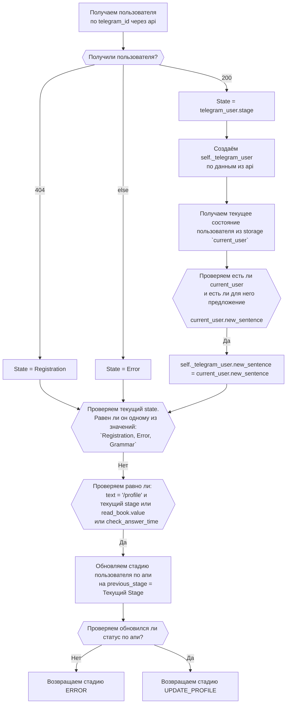

```mermaid
graph TD;
    start[Получаем пользователя
    по telegram_id через api
    ] --> check_get_user{{Получили пользователя?}}
    check_get_user --> |404| user_not_found[State = Registration]
    check_get_user --> |200| user_found[State = telegram_user.stage]
    check_get_user --> |else| error_user[State = Error]
    user_found --> create_telegram_user[
    Создаём self._telegram_user
    по данным из api
    ]
    create_telegram_user --> get_current_telegram_user[
    Получаем текущее состояние 
    пользователя из storage
    `current_user`
    ]
    get_current_telegram_user --> check_current_user{{
    Проверяем есть ли current_user
    и есть ли для него предложение
    current_user.new_sentence
    }}
    check_current_user --> |Да| update_new_sentence[self._telegram_user.new_sentence 
    = current_user.new_sentence
    ]
    user_not_found --> check_current_state{{
    Проверяем текущий state.
    Равен ли он одному из значений:
    `Registration, Error, Grammar`
    }}
    error_user --> check_current_state
    update_new_sentence --> check_current_state
    check_current_state --> |Нет| check_update_profile_state{{
    Проверяем равно ли: 
    text = '/profile' и
    текущий stage или read_book.value
    или check_answer_time
    }}
    check_update_profile_state --> |Да| update_stage_to_profile[
    Обновляем стадию пользователя по апи
    на previous_stage = Текущий Stage]
    update_stage_to_profile --> check_update_stage_to_profile{{
    Проверяем обновился ли статус по апи?
    }}
    check_update_stage_to_profile --> |Нет| return_error_update_stage_profile[
    Возвращаем стадию ERROR]
    check_update_stage_to_profile --> |Да| return_update_profle_stage[
    Возвращаем стадию UPDATE_PROFILE]
    
```