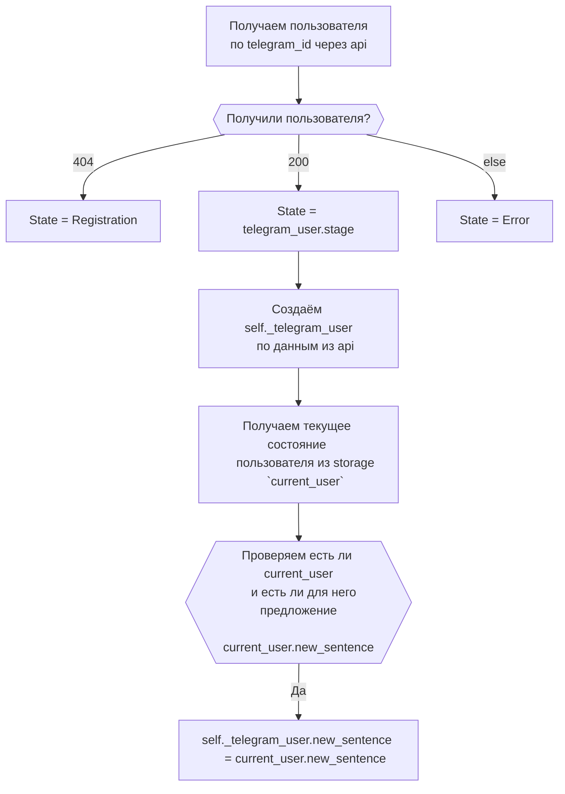

```mermaid
graph TD;
    start[Получаем пользователя
    по telegram_id через api
    ] --> check_get_user{{Получили пользователя?}}
    check_get_user --> |404| user_not_found[State = Registration]
    check_get_user --> |200| user_found[State = telegram_user.stage]
    check_get_user --> |else| error_user[State = Error]
    user_found --> create_telegram_user[
    Создаём self._telegram_user
    по данным из api
    ]
    create_telegram_user --> get_current_telegram_user[
    Получаем текущее состояние 
    пользователя из storage
    `current_user`
    ]
    get_current_telegram_user --> check_current_user{{
    Проверяем есть ли current_user
    и есть ли для него предложение
    current_user.new_sentence
    }}
    check_current_user --> |Да| update_new_sentence[self._telegram_user.new_sentence 
    = current_user.new_sentence
    ]
```