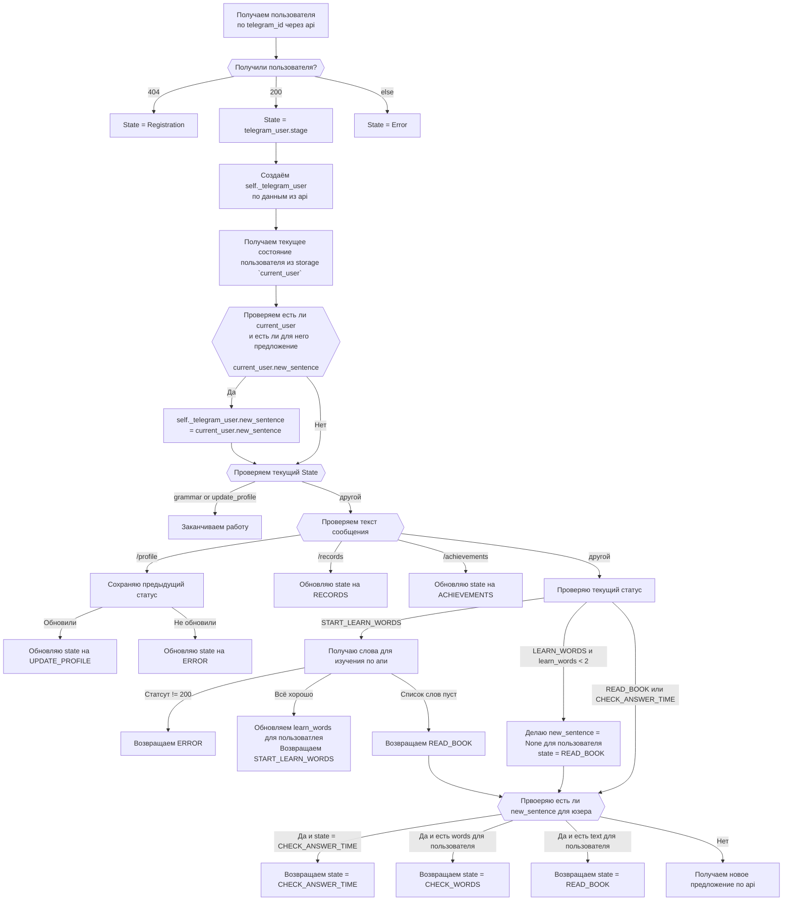

```mermaid
graph TD;
    start[Получаем пользователя
    по telegram_id через api
    ] --> check_get_user{{Получили пользователя?}}
    check_get_user --> |404| user_not_found[State = Registration]
    check_get_user --> |200| user_found[State = telegram_user.stage]
    check_get_user --> |else| error_user[State = Error]
    user_found --> create_telegram_user[
    Создаём self._telegram_user
    по данным из api
    ]
    create_telegram_user --> get_current_telegram_user[
    Получаем текущее состояние 
    пользователя из storage
    `current_user`
    ]
    get_current_telegram_user --> check_current_user{{
    Проверяем есть ли current_user
    и есть ли для него предложение
    current_user.new_sentence
    }}
    check_current_user --> |Да| update_new_sentence[self._telegram_user.new_sentence 
    = current_user.new_sentence
    ]
    check_current_user --> |Нет| check_current_state{{
        Проверяем текущий State
    }}
    update_new_sentence --> check_current_state
    check_current_state --> |grammar or update_profile| return_current_state[
        Заканчиваем работу
    ]
    check_current_state --> |другой| check_message_text{{
        Проверяем текст сообщения
    }}
    check_message_text --> |/profile| save_previous_state[Сохраняю предыдущий статус]
    save_previous_state --> |Обновили| good_update_update_profile_state[
        Обновляю state на UPDATE_PROFILE
    ]
    save_previous_state --> |Не обновили |bad_update_update_profile_state[
        Обновляю state на ERROR
    ]
    check_message_text --> |/records| update_record_state[Обновляю state на RECORDS]
    check_message_text --> |/achievements| update_achievements_state[Обновляю state на ACHIEVEMENTS]
    check_message_text --> |другой| check_status[Проверяю текущий статус
    ]
    check_status --> |START_LEARN_WORDS| get_learn_words_by_api[
        Получаю слова для изучения по апи
    ]
    get_learn_words_by_api --> |Статсут != 200| retrun_error_after_get_words[
        Возвращаем ERROR
    ]
    get_learn_words_by_api --> |Всё хорошо| retrun_start_learn_words_after_get_words[
        Обновляем learn_words для пользоватлея
        Возвращаем START_LEARN_WORDS
    ]
    get_learn_words_by_api --> |Список слов пуст| retrun_read_book_after_get_words[
        Возвращаем READ_BOOK
    ]
    check_status --> |LEARN_WORDS и learn_words < 2| return_read_book_last_word[
        Делаю new_sentence = None для пользователя
        state = READ_BOOK
    ]
    check_status --> |READ_BOOK или CHECK_ANSWER_TIME| check_new_sentence{{
        Првоеряю есть ли new_sentence для юзера
    }}
    return_read_book_last_word --> check_new_sentence
    retrun_read_book_after_get_words --> check_new_sentence
    check_new_sentence --> |Да и state = CHECK_ANSWER_TIME| return_check_answer_time[
        Возвращаем state = CHECK_ANSWER_TIME
    ]
    check_new_sentence --> |Да и есть words для пользователя| return_check_words[
        Возвращаем state = CHECK_WORDS
    ]
    check_new_sentence --> |Да и есть text для пользователя| return_check_read_books[
        Возвращаем state = READ_BOOK
    ]
    check_new_sentence --> |Нет| get_new_sentence_by_api[
        Получаем новое предложение по api
    ]
    

```