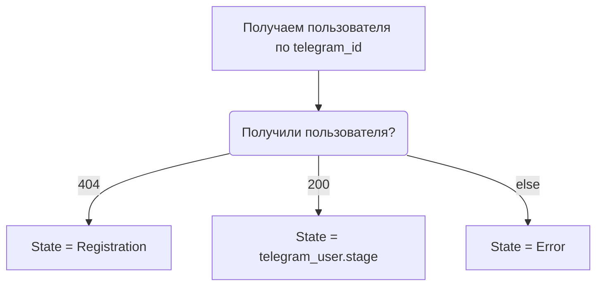

```mermaid
graph TD;
    start[Получаем пользователя по telegram_id] --> check_get_user(Получили пользователя?)
    check_get_user --> |404| user_not_found[State = Registration]
    check_get_user --> |200| user_found[State = telegram_user.stage]
    check_get_user --> |else| error_user[State = Error]
```