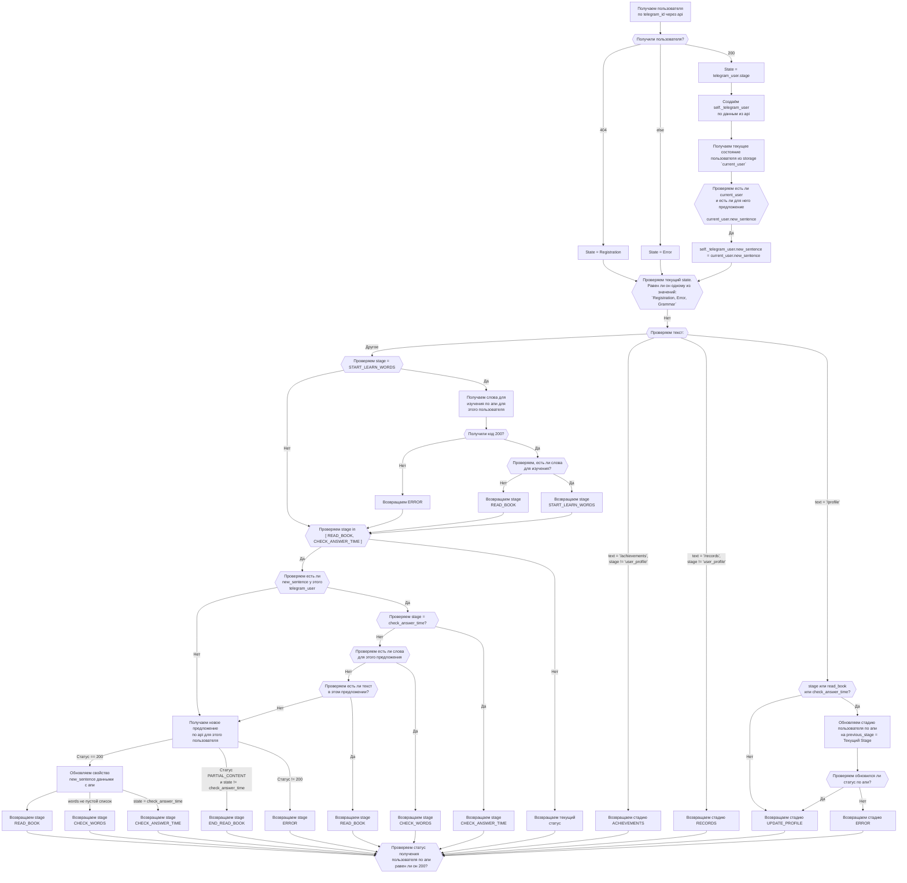

```mermaid
graph TD;
    start[Получаем пользователя
    по telegram_id через api
    ] --> check_get_user{{Получили пользователя?}}
    check_get_user --> |404| user_not_found[State = Registration]
    check_get_user --> |200| user_found[State = telegram_user.stage]
    check_get_user --> |else| error_user[State = Error]
    user_found --> create_telegram_user[
    Создаём self._telegram_user
    по данным из api
    ]
    create_telegram_user --> get_current_telegram_user[
    Получаем текущее состояние 
    пользователя из storage
    `current_user`
    ]
    get_current_telegram_user --> check_current_user{{
    Проверяем есть ли current_user
    и есть ли для него предложение
    current_user.new_sentence
    }}
    check_current_user --> |Да| update_new_sentence[self._telegram_user.new_sentence 
    = current_user.new_sentence
    ]
    user_not_found --> check_current_state{{
    Проверяем текущий state.
    Равен ли он одному из значений:
    `Registration, Error, Grammar`
    }}
    error_user --> check_current_state
    update_new_sentence --> check_current_state
    check_current_state --> |Нет| check_message_text{{
    Проверяем текст:
    }}
    check_message_text --> |text = '/profile'| check_current_stage_after_profile{{
    stage или read_book
    или check_answer_time?
    }}
    check_current_stage_after_profile --> |Да| update_stage_to_profile[
    Обновляем стадию пользователя по апи
    на previous_stage = Текущий Stage]
    check_current_stage_after_profile --> |Нет| return_update_profile_stage
    update_stage_to_profile --> check_update_stage_to_profile{{
    Проверяем обновился ли статус по апи?
    }}
    check_update_stage_to_profile --> |Нет| return_error_update_stage_profile[
    Возвращаем стадию ERROR]
    check_update_stage_to_profile --> |Да| return_update_profile_stage[
    Возвращаем стадию UPDATE_PROFILE]
    check_message_text --> |text = '/records', 
    stage != 'user_profile'| return_records_stage[
    Возвращаем стадию RECORDS]
    check_message_text --> |text = '/achievements', 
    stage != 'user_profile'| return_achievements_stage[
    Возвращаем стадию ACHIEVEMENTS]
    check_message_text --> |Другое| check_stage_start_learn_words{{
    Проверяем stage = START_LEARN_WORDS
    }}
    check_stage_start_learn_words --> |Нет| check_is_read_book{{
    Проверяем stage in 
    &lbrack; READ_BOOK, CHECK_ANSWER_TIME &rbrack;
    }}
    check_stage_start_learn_words --> |Да| get_learn_words[
    Получаем слова для 
    изучения по апи для 
    этого пользователя
    ]
    get_learn_words --> check_get_learn_words{{
    Получили код 200?
    }}
    check_get_learn_words --> |Нет| return_error_after_get_learn_words[
    Возвращаем ERROR
    ]
    check_get_learn_words --> |Да| check_have_words{{
    Проверяем, есть ли слова
    для изучения?
    }}
    check_have_words --> |Нет| return_read_book_after_get_learn_words[
    Возвращаем stage 
    READ_BOOK
    ]
    check_have_words --> |Да| return_start_learn_words_after_learn_words[
    Возвращаем stage
    START_LEARN_WORDS]
    return_error_after_get_learn_words --> check_is_read_book
    return_read_book_after_get_learn_words --> check_is_read_book
    return_start_learn_words_after_learn_words --> check_is_read_book
    check_is_read_book --> |Да| check_new_sentence{{
    Проверяем есть ли
    new_sentence у этого
    telegram_user
    }}
    check_is_read_book --> |Нет| return_current_stage[
    Возвращаем текущий
    статус
    ]
    check_new_sentence --> |Да| check_stage_after_new_sentence_is_time{{
    Проверяем stage = check_answer_time?
    }}
    check_stage_after_new_sentence_is_time --> |Да| return_check_answer_time[
    Возвращаем stage
    CHECK_ANSWER_TIME
    ]
    check_stage_after_new_sentence_is_time --> |Нет| check_words_for_sentence{{
    Проверяем есть ли слова
    для этого предложения
}}
    check_words_for_sentence --> |Да| return_check_words_for_sentence[
    Возвращаем stage
    CHECK_WORDS
    ]
    check_words_for_sentence --> |Нет| check_text_for_sentence{{
    Проверяем есть ли текст
    в этом предложении?
    }}
    check_text_for_sentence --> |Да| return_read_this_sentence[
    Возвращаем stage
    READ_BOOK
    ]
    check_new_sentence --> |Нет| get_new_sentence_by_api[
    Получаем новое предложение
    по api для этого пользователя
    ]
    check_text_for_sentence --> |Нет| get_new_sentence_by_api
    get_new_sentence_by_api --> |Статус PARTIAL_CONTENT
    и state != check_answer_time| return_end_read_book_after_get_sentence[
    Возвращаем stage
    END_READ_BOOK]
    get_new_sentence_by_api --> |Статус != 200| return_error_after_get_sentence[
    Возвращаем stage
    ERROR
    ]
    get_new_sentence_by_api --> |Статус == 200| update_new_sentence_for_user[
    Обновляем свойство
    new_sentence данными с апи]
    update_new_sentence_for_user --> |state = check_answer_time| return_check_answer_time_after_get_sentence[
    Возвращаем stage
    CHECK_ANSWER_TIME]
    update_new_sentence_for_user --> |words не пустой список| return_check_words_after_get_sentence[
    Возвращаем stage
    CHECK_WORDS]
    update_new_sentence_for_user --> return_read_book_after_get_sentence[
    Возвращаем stage
    READ_BOOK]
    return_read_book_after_get_sentence --> check_status_get_telegram_user{{
    Проверяем статус получения
    пользователя по апи
    равен ли он 200?
    }}
    return_check_words_after_get_sentence --> check_status_get_telegram_user
    return_check_answer_time_after_get_sentence --> check_status_get_telegram_user
    return_end_read_book_after_get_sentence --> check_status_get_telegram_user
    return_error_after_get_sentence --> check_status_get_telegram_user
    return_read_this_sentence --> check_status_get_telegram_user
    return_check_words_for_sentence --> check_status_get_telegram_user
    return_check_answer_time --> check_status_get_telegram_user
    return_current_stage --> check_status_get_telegram_user
    return_achievements_stage --> check_status_get_telegram_user
    return_records_stage --> check_status_get_telegram_user
    return_update_profile_stage --> check_status_get_telegram_user
    return_error_update_stage_profile --> check_status_get_telegram_user
```